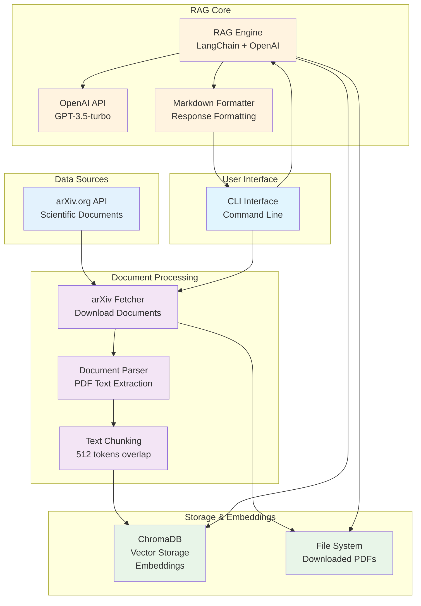

# Простая RAG-система для работы с arXiv.org

## Обзор системы

Упрощенная RAG-система для получения и анализа научных статей с arXiv.org через CLI интерфейс. Система автоматически загружает статьи по заданным запросам поиска и предоставляет возможность задавать вопросы по их содержанию.

## Принципы разработки

### Основные принципы
- **KISS (Keep It Simple, Stupid)** - максимально простое решение, избегаем оверинжиниринга
- **YAGNI (You Aren't Gonna Need It)** - реализуем только необходимый функционал
- **DRY (Don't Repeat Yourself)** - избегаем дублирования кода
- **SOLID** - следуем принципам объектно-ориентированного программирования

### Подход к тестированию
- **Unit-тесты** - обязательны для всех ключевых компонентов
- **Интеграционные тесты** - по согласованию для критических сценариев
- **Code review** - пока не внедряем, планируется на более поздних этапах

### Качество кода
- Строгая типизация для публичных API
- Документирование всех публичных методов
- Следование PEP 8 стандартам Python
- Минимальная сложность архитектуры

## Минимальная архитектура

### Основные компоненты (всего 6 элементов):

1. **arXiv Fetcher** - Получение статей с arXiv.org по запросу
2. **Document Parser** - Извлечение текста из PDF статей
3. **Векторная база данных** - ChromaDB (встроенная)
4. **RAG Engine** - LangChain + OpenAI API
5. **Markdown Formatter** - Форматирование ответов в MD
6. **CLI Interface** - Командный интерфейс для управления

## Архитектурная диаграмма



## Модель данных

### Структура данных документов

#### Метаданные документа (извлекаются при скачивании)
```python
@dataclass
class DocumentMeta:
    id: str                    # arXiv ID (например: "2023.12345")
    title: str                 # Заголовок документа
    authors: List[str]         # Список авторов
    abstract: str              # Аннотация
    published_date: datetime   # Дата публикации на arXiv
    download_date: datetime    # Дата скачивания в систему
    download_url: str          # URL для скачивания PDF
    categories: List[str]      # Категории arXiv
    pdf_path: str              # Локальный путь к PDF файлу
```

#### Структура чанков в векторной базе
```python
@dataclass
class DocumentChunk:
    chunk_id: int              # Уникальный ID чанка в документе
    content: str               # Текстовое содержимое чанка
    file_path: str             # Путь к исходному PDF файлу
    document_id: str           # arXiv ID документа
    chunk_index: int           # Порядковый номер чанка
    token_count: int           # Количество токенов в чанке
```

#### Схема ChromaDB коллекции
```python
# Коллекция: "arxiv_documents"
{
    "ids": ["document_id_chunk_0", "document_id_chunk_1", ...],
    "embeddings": [[0.1, 0.2, ...], [0.3, 0.4, ...], ...],  # OpenAI embeddings
    "metadatas": [
        {
            "file": "/path/to/document.pdf",
            "document_id": "2023.12345",
            "chunk_id": 0,
            "title": "Document Title",
            "authors": "Author1, Author2",
            "published_date": "2023-01-15",
            "download_date": "2024-01-15",
            "categories": "cs.AI, cs.LG"
        },
        ...
    ],
    "documents": ["chunk content 1", "chunk content 2", ...]
}
```

### Процедура извлечения метаданных

#### 1. При скачивании документа
```python
def extract_document_metadata(arxiv_result) -> DocumentMeta:
    """Извлекает метаданные из результата arXiv API"""
    return DocumentMeta(
        id=extract_arxiv_id(arxiv_result.entry_id),
        title=arxiv_result.title,
        authors=[author.name for author in arxiv_result.authors],
        abstract=arxiv_result.summary,
        published_date=arxiv_result.published,
        download_date=datetime.now(),
        download_url=arxiv_result.pdf_url,
        categories=arxiv_result.categories,
        pdf_path=f"./papers/{extract_arxiv_id(arxiv_result.entry_id)}.pdf"
    )
```

#### 2. При обработке PDF
```python
def create_document_chunks(pdf_path: str, metadata: DocumentMeta) -> List[DocumentChunk]:
    """Создает чанки из PDF с привязкой к метаданным"""
    text = extract_text_from_pdf(pdf_path)
    chunks = split_text_into_chunks(text, chunk_size=512, overlap=50)
    
    document_chunks = []
    for i, chunk_text in enumerate(chunks):
        chunk = DocumentChunk(
            chunk_id=i,
            content=chunk_text,
            file_path=pdf_path,
            document_id=metadata.id,
            chunk_index=i,
            token_count=count_tokens(chunk_text)
        )
        document_chunks.append(chunk)
    
    return document_chunks
```

### Хранение данных

#### Файловая система
```
papers/                       # Загруженные PDF файлы
├── 2023.12345.pdf
├── 2023.67890.pdf
└── ...

chroma_db/                    # Векторная база данных ChromaDB
├── chroma.sqlite3
└── ...

metadata/                     # Метаданные документов (JSON)
├── 2023.12345.json
├── 2023.67890.json
└── ...
```

#### Формат файла метаданных
```json
{
    "id": "2023.12345",
    "title": "Retrieval-Augmented Generation for Knowledge-Intensive NLP Tasks",
    "authors": ["Patrick Lewis", "Ethan Perez", "Aleksandra Piktus"],
    "abstract": "Large pre-trained transformer language models...",
    "published_date": "2023-01-15T00:00:00Z",
    "download_date": "2024-01-15T10:30:00Z",
    "download_url": "https://arxiv.org/pdf/2023.12345.pdf",
    "categories": ["cs.CL", "cs.AI"],
    "pdf_path": "./papers/2023.12345.pdf",
    "chunk_count": 15,
    "total_tokens": 7680
}
```

## Технический стек

### Backend
```python
# requirements.txt
arxiv==2.1.0
langchain==0.0.350
chromadb==0.4.18
openai==1.3.7
pypdf2==3.0.1
click==8.1.7
python-dotenv==1.0.0
requests==2.31.0
markdown==3.5.1
```

### Структура проекта
```
arxiv-rag/
├── cli.py               # CLI интерфейс
├── arxiv_fetcher.py     # Получение статей с arXiv
├── rag_engine.py        # RAG логика
├── document_parser.py   # Парсер PDF документов
├── markdown_formatter.py # Форматирование ответов в MD
├── requirements.txt     # Зависимости
├── .env                 # Переменные окружения
├── papers/             # Папка с загруженными документами
│   ├── 2023.12345.pdf
│   └── 2023.67890.pdf
├── output/             # Папка с сохраненными ответами
│   ├── what_is_rag_2024-01-15.md
│   └── llm_approaches_2024-01-15.md
└── chroma_db/          # База данных векторов
```

## CLI Команды

### Основные команды:
```bash
# Загрузка статей с arXiv.org
python cli.py fetch "LLM ML RAG" --max-results 10

# Поиск по загруженным статьям
python cli.py search "What are the main approaches to RAG?"

# Поиск с сохранением в файл
python cli.py search "What is RAG?" --save-to-file

# Поиск с сохранением в указанную директорию
python cli.py search "LLM techniques" --save-to-file --output-dir ./reports/

# Список загруженных статей
python cli.py list

# Очистка базы данных
python cli.py clear

# Помощь
python cli.py --help
```

## Реализация компонентов

### 1. arXiv Fetcher (arxiv_fetcher.py)
```python
import arxiv
import os
import requests
from typing import List, Dict
from pathlib import Path

class ArxivFetcher:
    def __init__(self, papers_dir: str = "./papers"):
        self.papers_dir = Path(papers_dir)
        self.papers_dir.mkdir(exist_ok=True)
    
    def search_documents(self, query: str, max_results: int = 10) -> List[Dict]:
        """Search for documents on arXiv"""
        client = arxiv.Client()
        search = arxiv.Search(
            query=query,
            max_results=max_results,
            sort_by=arxiv.SortCriterion.Relevance
        )
        
        documents = []
        for result in client.results(search):
            document_info = {
                "id": result.entry_id.split('/')[-1],
                "title": result.title,
                "authors": [author.name for author in result.authors],
                "abstract": result.summary,
                "published": result.published,
                "pdf_url": result.pdf_url,
                "categories": result.categories
            }
            documents.append(document_info)
        
        return documents
    
    def download_document(self, document_info: Dict) -> str:
        """Download PDF document"""
        document_id = document_info["id"]
        pdf_url = document_info["pdf_url"]
        filename = f"{document_id}.pdf"
        filepath = self.papers_dir / filename
        
        if filepath.exists():
            print(f"Document {document_id} already exists")
            return str(filepath)
        
        try:
            response = requests.get(pdf_url)
            response.raise_for_status()
            
            with open(filepath, 'wb') as f:
                f.write(response.content)
            
            print(f"Downloaded: {document_info['title']}")
            return str(filepath)
            
        except Exception as e:
            print(f"Error downloading {document_id}: {e}")
            return None
    
    def fetch_and_download(self, query: str, max_results: int = 10) -> List[str]:
        """Search and download documents"""
        documents = self.search_documents(query, max_results)
        downloaded_files = []
        
        for document in documents:
            filepath = self.download_document(document)
            if filepath:
                downloaded_files.append(filepath)
        
        return downloaded_files
```

### 2. Document Parser (document_parser.py)
```python
import os
import PyPDF2
from typing import List, Dict
from langchain.text_splitter import RecursiveCharacterTextSplitter

class DocumentParser:
    def __init__(self, chunk_size: int = 512, chunk_overlap: int = 50):
        self.text_splitter = RecursiveCharacterTextSplitter(
            chunk_size=chunk_size,
            chunk_overlap=chunk_overlap,
            length_function=len,
        )
    
    def parse_pdf(self, file_path: str) -> str:
        """Extract text from PDF file"""
        text = ""
        with open(file_path, 'rb') as file:
            pdf_reader = PyPDF2.PdfReader(file)
            for page in pdf_reader.pages:
                text += page.extract_text() + "\n"
        return text
    
    def parse_document(self, file_path: str) -> List[str]:
        """Parse PDF document and return chunks"""
        if not file_path.endswith('.pdf'):
            raise ValueError("Only PDF files are supported")
        
        text = self.parse_pdf(file_path)
        
        # Split into chunks
        chunks = self.text_splitter.split_text(text)
        return chunks
    
    def get_document_metadata(self, file_path: str) -> Dict:
        """Get document metadata"""
        return {
            "file": file_path,
            "filename": os.path.basename(file_path),
            "file_type": "pdf"
        }
```

### 3. RAG Engine (rag_engine.py)
```python
import os
from typing import List, Dict
from langchain.embeddings import OpenAIEmbeddings
from langchain.vectorstores import Chroma
from langchain.chains import RetrievalQA
from langchain.llms import OpenAI
from langchain.schema import Document
from document_parser import DocumentParser

class ArxivRAGEngine:
    def __init__(self, persist_directory: str = "./chroma_db"):
        self.persist_directory = persist_directory
        self.embeddings = OpenAIEmbeddings()
        self.llm = OpenAI(temperature=0, model_name="gpt-3.5-turbo")
        self.parser = DocumentParser()
        self.vectorstore = None
        self.qa_chain = None
        
        # Initialize or load existing vectorstore
        self._initialize_vectorstore()
    
    def _initialize_vectorstore(self):
        """Initialize or load existing vectorstore"""
        if os.path.exists(self.persist_directory):
            # Load existing vectorstore
            self.vectorstore = Chroma(
                persist_directory=self.persist_directory,
                embedding_function=self.embeddings
            )
        else:
            # Create new vectorstore
            self.vectorstore = Chroma(
                persist_directory=self.persist_directory,
                embedding_function=self.embeddings
            )
        
        # Create QA chain
        self.qa_chain = RetrievalQA.from_chain_type(
            llm=self.llm,
            chain_type="stuff",
            retriever=self.vectorstore.as_retriever(search_kwargs={"k": 3}),
            return_source_documents=True
        )
    
    def add_documents(self, papers_dir: str):
        """Add all PDF documents from directory to vectorstore"""
        documents = []
        metadatas = []
        
        for filename in os.listdir(papers_dir):
            if filename.endswith('.pdf'):
                file_path = os.path.join(papers_dir, filename)
                try:
                    # Parse document
                    chunks = self.parser.parse_document(file_path)
                    metadata = self.parser.get_document_metadata(file_path)
                    
                    # Create documents for each chunk
                    for i, chunk in enumerate(chunks):
                        doc = Document(
                            page_content=chunk,
                            metadata={**metadata, "chunk_id": i}
                        )
                        documents.append(doc)
                        metadatas.append({**metadata, "chunk_id": i})
                    
                    print(f"Added {len(chunks)} chunks from {filename}")
                    
                except Exception as e:
                    print(f"Error processing {filename}: {e}")
        
        if documents:
            # Add to vectorstore
            self.vectorstore.add_documents(documents)
            self.vectorstore.persist()
            print(f"Added {len(documents)} total chunks to vectorstore")
    
    def search(self, query: str) -> Dict:
        """Search and answer query"""
        try:
            result = self.qa_chain({"query": query})
            return {
                "answer": result["result"],
                "sources": [
                    {
                        "content": doc.page_content[:200] + "...",
                        "file": doc.metadata.get("file", "Unknown"),
                        "chunk_id": doc.metadata.get("chunk_id", 0)
                    }
                    for doc in result["source_documents"]
                ]
            }
        except Exception as e:
            return {"error": f"Search failed: {str(e)}"}
    
    def get_document_count(self) -> int:
        """Get total number of documents in vectorstore"""
        try:
            return self.vectorstore._collection.count()
        except:
            return 0
    
    def clear_database(self):
        """Clear the vector database"""
        import shutil
        if os.path.exists(self.persist_directory):
            shutil.rmtree(self.persist_directory)
        self._initialize_vectorstore()
        print("Database cleared successfully")
```

### 4. Markdown Formatter (markdown_formatter.py)
```python
import os
from datetime import datetime
from typing import Dict, List
from pathlib import Path

class MarkdownFormatter:
    def __init__(self, output_dir: str = "./output"):
        self.output_dir = Path(output_dir)
        self.output_dir.mkdir(exist_ok=True)
    
    def format_response(self, query: str, result: Dict) -> str:
        """Format RAG response as Markdown"""
        if "error" in result:
            return f"# Error\n\n{result['error']}"
        
        # Create markdown content
        md_content = []
        
        # Header
        md_content.append(f"# Research Query: {query}")
        md_content.append(f"\n**Generated on:** {datetime.now().strftime('%Y-%m-%d %H:%M:%S')}")
        md_content.append("")
        
        # Answer section
        md_content.append("## Answer")
        md_content.append("")
        md_content.append(result["answer"])
        md_content.append("")
        
        # Sources section
        if result.get("sources"):
            md_content.append("## Sources")
            md_content.append("")
            
            for i, source in enumerate(result["sources"], 1):
                filename = os.path.basename(source["source"])
                md_content.append(f"### Source {i}: {filename}")
                md_content.append("")
                md_content.append(f"**Chunk ID:** {source['chunk_id']}")
                md_content.append("")
                md_content.append("**Content:**")
                md_content.append("")
                md_content.append(f"> {source['content']}")
                md_content.append("")
        
        return "\n".join(md_content)
    
    def save_to_file(self, query: str, result: Dict, output_dir: str = None) -> str:
        """Save formatted response to file"""
        if output_dir:
            output_path = Path(output_dir)
            output_path.mkdir(exist_ok=True)
        else:
            output_path = self.output_dir
        
        # Generate filename from query
        safe_query = "".join(c for c in query if c.isalnum() or c in (' ', '-', '_')).rstrip()
        safe_query = safe_query.replace(' ', '_').lower()[:50]
        timestamp = datetime.now().strftime('%Y-%m-%d')
        filename = f"{safe_query}_{timestamp}.md"
        
        filepath = output_path / filename
        
        # Format and save
        md_content = self.format_response(query, result)
        
        with open(filepath, 'w', encoding='utf-8') as f:
            f.write(md_content)
        
        return str(filepath)
    
    def format_sources_list(self, sources: List[Dict]) -> str:
        """Format sources as a simple list"""
        if not sources:
            return "No sources found."
        
        md_content = []
        md_content.append("## Sources")
        md_content.append("")
        
        for i, source in enumerate(sources, 1):
            filename = os.path.basename(source["source"])
            md_content.append(f"{i}. **{filename}** (chunk {source['chunk_id']})")
            md_content.append(f"   {source['content'][:100]}...")
            md_content.append("")
        
        return "\n".join(md_content)
```

### 5. CLI Interface (cli.py)
```python
import click
import os
from arxiv_fetcher import ArxivFetcher
from rag_engine import ArxivRAGEngine
from markdown_formatter import MarkdownFormatter

@click.group()
def cli():
    """arXiv RAG System - Search and analyze scientific documents"""
    pass

@cli.command()
@click.argument('query')
@click.option('--max-results', default=10, help='Maximum number of documents to fetch')
@click.option('--papers-dir', default='./papers', help='Directory to store downloaded documents')
def fetch(query, max_results, papers_dir):
    """Fetch documents from arXiv.org"""
    click.echo(f"Searching arXiv for: {query}")
    
    fetcher = ArxivFetcher(papers_dir)
    downloaded_files = fetcher.fetch_and_download(query, max_results)
    
    if downloaded_files:
        click.echo(f"Downloaded {len(downloaded_files)} documents")
        
        # Add documents to RAG engine
        rag_engine = ArxivRAGEngine()
        rag_engine.add_documents(papers_dir)
        click.echo("Documents added to search database")
    else:
        click.echo("No documents were downloaded")

@cli.command()
@click.argument('question')
@click.option('--papers-dir', default='./papers', help='Directory with documents')
@click.option('--save-to-file', is_flag=True, help='Save response to Markdown file')
@click.option('--output-dir', default='./output', help='Directory to save output files')
def search(question, papers_dir, save_to_file, output_dir):
    """Search through downloaded documents"""
    if not os.path.exists(papers_dir) or not os.listdir(papers_dir):
        click.echo("No documents found. Use 'fetch' command first.")
        return
    
    click.echo(f"Searching for: {question}")
    
    rag_engine = ArxivRAGEngine()
    result = rag_engine.search(question)
    
    if "error" in result:
        click.echo(f"Error: {result['error']}")
    else:
        if save_to_file:
            # Save to file using Markdown formatter
            formatter = MarkdownFormatter(output_dir)
            filepath = formatter.save_to_file(question, result, output_dir)
            click.echo(f"\nResponse saved to: {filepath}")
            
            # Also show a preview
            click.echo("\nPreview:")
            click.echo("=" * 50)
            click.echo(result["answer"][:200] + "..." if len(result["answer"]) > 200 else result["answer"])
        else:
            # Display in console
            click.echo("\nAnswer:")
            click.echo(result["answer"])
            
            if result["sources"]:
                click.echo("\nSources:")
                for i, source in enumerate(result["sources"], 1):
                    click.echo(f"{i}. {source['file']} (chunk {source['chunk_id']})")
                    click.echo(f"   {source['content']}...")

@cli.command()
@click.option('--papers-dir', default='./papers', help='Directory with documents')
def list(papers_dir):
    """List downloaded documents"""
    if not os.path.exists(papers_dir):
        click.echo("Documents directory does not exist")
        return
    
    documents = [f for f in os.listdir(papers_dir) if f.endswith('.pdf')]
    
    if not documents:
        click.echo("No documents found")
    else:
        click.echo(f"Found {len(documents)} documents:")
        for document in documents:
            click.echo(f"  - {document}")

@cli.command()
def clear():
    """Clear the search database"""
    if click.confirm("Are you sure you want to clear the database?"):
        rag_engine = ArxivRAGEngine()
        rag_engine.clear_database()
        click.echo("Database cleared")

if __name__ == '__main__':
    cli()
```

### 5. Environment Configuration (.env)
```bash
# OpenAI API Key
OPENAI_API_KEY=your_openai_api_key_here

# Optional: Custom model settings
OPENAI_MODEL_NAME=gpt-3.5-turbo
OPENAI_TEMPERATURE=0
```

### 6. Setup Script (setup.py)
```python
import os
import subprocess
import sys

def setup_environment():
    """Setup the arXiv RAG environment"""
    
    # Create directories
    os.makedirs("papers", exist_ok=True)
    os.makedirs("chroma_db", exist_ok=True)
    os.makedirs("output", exist_ok=True)
    
    # Install requirements
    subprocess.check_call([sys.executable, "-m", "pip", "install", "-r", "requirements.txt"])
    
    # Create .env file if it doesn't exist
    if not os.path.exists(".env"):
        with open(".env", "w") as f:
            f.write("OPENAI_API_KEY=your_openai_api_key_here\n")
            f.write("OPENAI_MODEL_NAME=gpt-3.5-turbo\n")
            f.write("OPENAI_TEMPERATURE=0\n")
        print("Created .env file. Please add your OpenAI API key.")
    
    print("Setup complete!")
    print("1. Add your OpenAI API key to .env file")
    print("2. Fetch documents: python cli.py fetch 'LLM ML RAG'")
    print("3. Search documents: python cli.py search 'your question'")

if __name__ == "__main__":
    setup_environment()
```

## Быстрый старт

### 1. Установка
```bash
# Clone or create project directory
mkdir arxiv-rag
cd arxiv-rag

# Create setup script and run
python setup.py
```

### 2. Настройка
```bash
# Add your OpenAI API key to .env file
echo "OPENAI_API_KEY=sk-your-key-here" > .env
```

### 3. Использование
```bash
# Fetch documents from arXiv
python cli.py fetch "LLM ML RAG" --max-results 10

# Search through documents
python cli.py search "What are the main approaches to RAG?"

# List downloaded documents
python cli.py list

# Clear database
python cli.py clear
```

## Преимущества упрощенной архитектуры

### ✅ Простота
- Всего 6 основных компонентов
- Минимум зависимостей
- CLI интерфейс без веб-сервера

### ✅ Экономичность
- Использует бесплатные компоненты (ChromaDB, arXiv API)
- Только плата за OpenAI API
- Локальное хранение данных

### ✅ Быстрота разработки
- Готовый код для всех компонентов
- Простая настройка
- Минимум конфигурации

### ✅ Автоматизация
- Автоматическая загрузка статей с arXiv
- Интеграция с научными публикациями
- Поддержка больших объемов статей

### ✅ Форматирование
- Генерация ответов в формате Markdown
- Сохранение результатов в файлы
- Структурированный и читаемый вывод

## Ограничения

### ❌ Функциональность
- Только PDF статьи с arXiv
- Простая обработка документов
- Ограниченная аналитика

### ❌ Производительность
- Один поток обработки
- Нет кэширования
- Простая обработка ошибок

### ❌ Безопасность
- Нет аутентификации
- Локальное хранение API ключей
- Нет аудита действий

## Возможные улучшения

### Краткосрочные (1-2 недели)
1. **Кэширование** - Redis для кэширования результатов
2. **Лучший парсинг** - Улучшенное извлечение текста из PDF
3. **CLI улучшения** - Цветной вывод и прогресс-бары

### Среднесрочные (1-2 месяца)
1. **Локальные модели** - Ollama для работы без API
2. **Гибридный поиск** - Комбинация векторного и текстового поиска
3. **Аналитика** - Статистика использования и метрики

### Долгосрочные (3+ месяца)
1. **Мультимодальность** - Обработка изображений и таблиц
2. **Агенты** - Автоматическое исследование статей
3. **Граф знаний** - Построение связей между статьями

## Мониторинг

### Метрики производительности

#### Время ответа
- **Цель**: < 10 секунд на запрос поиска
- **Измерение**: время от отправки запроса до получения ответа
- **Логирование**: в файл `log/performance.log`

```python
import time
import logging

def log_response_time(func):
    def wrapper(*args, **kwargs):
        start_time = time.time()
        result = func(*args, **kwargs)
        end_time = time.time()
        
        response_time = end_time - start_time
        logging.info(f"Response time: {response_time:.2f}s for {func.__name__}")
        
        return result
    return wrapper
```

#### Метаданные от модели
- **Количество токенов**: входные и выходные токены
- **Стоимость запроса**: расчет на основе токенов
- **Модель**: используемая модель OpenAI

```python
@dataclass
class ModelMetrics:
    input_tokens: int
    output_tokens: int
    total_tokens: int
    cost_usd: float
    model_name: str
    response_time: float

def log_model_metrics(metrics: ModelMetrics):
    """Логирование метрик модели"""
    logging.info(f"Model: {metrics.model_name}")
    logging.info(f"Tokens: {metrics.input_tokens} in, {metrics.output_tokens} out")
    logging.info(f"Cost: ${metrics.cost_usd:.4f}")
    logging.info(f"Response time: {metrics.response_time:.2f}s")
```

### Логирование действий пользователей

#### Уровни логирования
- **INFO**: успешные операции (загрузка статей, поиск)
- **WARN**: предупреждения (медленные запросы, частичные ошибки)
- **ERROR**: критические ошибки (сбои API, ошибки парсинга)

#### Структура логов
```
log/
├── app.log              # Основные логи приложения
├── performance.log      # Метрики производительности
├── user_actions.log     # Действия пользователей
└── errors.log           # Ошибки и исключения
```

#### Примеры логов
```python
# Успешная загрузка документа
INFO: Downloaded document: "Retrieval-Augmented Generation" (2023.12345)

# Поиск с метриками
INFO: Search query: "What is RAG?" - Response time: 3.2s
INFO: Model: gpt-3.5-turbo, Tokens: 150 in, 200 out, Cost: $0.0012

# Предупреждение о медленном запросе
WARN: Slow response detected: 12.5s for query "complex question"

# Ошибка загрузки
ERROR: Failed to download document 2023.12345: Connection timeout
```

### Минимальный мониторинг

#### Автоматические проверки
- Проверка доступности OpenAI API
- Проверка состояния ChromaDB
- Мониторинг свободного места на диске

```python
def health_check():
    """Проверка состояния системы"""
    checks = {
        "openai_api": check_openai_connection(),
        "chromadb": check_chromadb_status(),
        "disk_space": check_disk_space(),
        "documents_dir": check_documents_directory()
    }
    
    for service, status in checks.items():
        if not status:
            logging.error(f"Health check failed: {service}")
        else:
            logging.info(f"Health check passed: {service}")
    
    return all(checks.values())
```

#### Алерты (будущее развитие)
- Уведомления о превышении времени ответа
- Алерты о критических ошибках
- Мониторинг использования API квот

## Сценарии работы

### Основные пользовательские сценарии

#### Сценарий 1: Интерактивный поиск
**Описание**: Пользователь работает в интерактивном режиме через консоль

```bash
# 1. Загрузка статей по теме
python cli.py fetch "machine learning transformers" --max-results 5

# 2. Интерактивный поиск
python cli.py search "What are the main advantages of transformers?"
# Вывод: ответ в формате Markdown в консоли

# 3. Дополнительные вопросы
python cli.py search "How do attention mechanisms work?"
# Вывод: новый ответ на основе тех же статей
```

**Ожидаемый результат**: 
- Статьи загружены и проиндексированы
- Ответы генерируются в формате Markdown
- Источники указываются для каждого ответа

#### Сценарий 2: Автоматизированный поиск
**Описание**: Пользователь запускает CLI команду с готовым запросом

```bash
# Одной командой: загрузка + поиск
python cli.py fetch "RAG retrieval augmented generation" --max-results 10
python cli.py search "What is RAG and how does it work?" --save-to-file
```

**Ожидаемый результат**:
- Статьи загружены автоматически
- Ответ сохранен в файл `./output/what_is_rag_and_how_does_it_work_2024-01-15.md`
- Файл содержит структурированный ответ с источниками

#### Сценарий 3: Управление коллекцией
**Описание**: Пользователь управляет загруженными статьями

```bash
# Просмотр загруженных статей
python cli.py list

# Очистка базы данных
python cli.py clear
# Подтверждение: Are you sure you want to clear the database? [y/N]: y
```

**Ожидаемый результат**:
- Список всех загруженных PDF файлов
- Подтверждение перед очисткой базы данных

### Критические edge cases

#### Сценарий 4: Обработка ошибок сети
**Описание**: Проблемы с подключением к arXiv или OpenAI

```python
# При загрузке документа
try:
    document = download_document(url)
except ConnectionError:
    logging.error("Failed to download document: network error")
    continue  # Продолжить с следующим документом

# При запросе к OpenAI
try:
    response = openai_client.chat.completions.create(...)
except openai.RateLimitError:
    logging.warn("Rate limit exceeded, retrying in 60s")
    time.sleep(60)
    retry_request()
```

**Ожидаемое поведение**:
- Система продолжает работу при частичных сбоях
- Ошибки логируются с подробностями
- Пользователь получает понятные сообщения об ошибках

#### Сценарий 5: Обработка поврежденных PDF
**Описание**: PDF файл не может быть обработан

```python
def parse_pdf_safely(file_path: str):
    try:
        return extract_text_from_pdf(file_path)
    except PyPDF2.PdfReadError:
        logging.error(f"Cannot read PDF: {file_path}")
        return None
    except Exception as e:
        logging.error(f"Unexpected error parsing {file_path}: {e}")
        return None
```

**Ожидаемое поведение**:
- Поврежденные PDF пропускаются
- Ошибка логируется
- Остальные файлы обрабатываются нормально

#### Сценарий 6: Превышение лимитов API
**Описание**: Достигнут лимит запросов к OpenAI

```python
def handle_rate_limit():
    """Обработка превышения лимитов API"""
    logging.warn("OpenAI rate limit exceeded")
    
    # Вариант 1: Ожидание
    time.sleep(60)
    
    # Вариант 2: Переключение на другую модель
    # switch_to_alternative_model()
    
    # Вариант 3: Сохранение запроса для повторной попытки
    # save_query_for_retry()
```

**Ожидаемое поведение**:
- Система автоматически обрабатывает лимиты
- Пользователь уведомлен о задержке
- Запросы не теряются

### Сценарии производительности

#### Сценарий 7: Большой объем данных
**Описание**: Загрузка большого количества документов

```bash
# Загрузка 50 документов
python cli.py fetch "deep learning" --max-results 50
```

**Ожидаемое поведение**:
- Прогресс-бар показывает статус загрузки
- Память используется эффективно
- Система остается отзывчивой

#### Сценарий 8: Медленные запросы
**Описание**: Сложные запросы, требующие больше времени

```python
def handle_slow_query(query: str):
    """Обработка медленных запросов"""
    start_time = time.time()
    
    # Показать индикатор прогресса
    print("Processing complex query...")
    
    result = rag_engine.search(query)
    
    response_time = time.time() - start_time
    if response_time > 10:
        logging.warn(f"Slow query detected: {response_time:.2f}s")
    
    return result
```

**Ожидаемое поведение**:
- Пользователь видит прогресс обработки
- Медленные запросы логируются
- Система не блокируется

## Анализ компонентов архитектуры

### 1. arXiv Fetcher - Получение статей с arXiv.org
**Тип:** API интеграция
**Docker:** ❌ Не требуется
**Библиотеки:** 
- **arxiv** - официальный клиент arXiv API
- **requests** - для загрузки PDF файлов
**Реализация:** Поиск и загрузка статей по запросу

### 2. Document Parser - Извлечение текста из PDF
**Тип:** Кастомный компонент
**Docker:** ❌ Не требуется (легковесный)
**Библиотеки:**
- **PyPDF2** - для PDF файлов
- **langchain.text_splitter** - для разбивки на чанки
**Альтернативы:**
- **unstructured** - универсальный парсер документов
- **pymupdf (fitz)** - более мощный PDF парсер
- **pdfplumber** - PDF с сохранением структуры

### 3. Векторная база данных - ChromaDB
**Тип:** Готовый Docker-контейнер
**Docker:** ✅ **chromadb/chroma:latest**
**Библиотеки:** 
- **chromadb** - Python клиент
- **sentence-transformers** - для эмбеддингов
**Альтернативы:**
- **Weaviate** - `semitechnologies/weaviate:latest`
- **Qdrant** - `qdrant/qdrant:latest`
- **Pinecone** - облачный сервис

### 4. RAG Engine - LangChain + OpenAI API
**Тип:** Кастомный компонент
**Docker:** ❌ Не требуется (API-based)
**Библиотеки:**
- **langchain** - основной фреймворк
- **openai** - API клиент
- **tiktoken** - токенизация
**Альтернативы:**
- **llama-index** - альтернативный RAG фреймворк
- **haystack** - end-to-end NLP фреймворк
- **transformers** - для локальных моделей

### 5. Markdown Formatter - Кастомный компонент
**Тип:** Кастомный компонент
**Docker:** ❌ Не требуется
**Библиотеки:** 
- **markdown** - обработка Markdown
- **datetime** - генерация временных меток
**Реализация:** Форматирование ответов и сохранение в файлы

### 6. CLI Interface - Click
**Тип:** Кастомный компонент
**Docker:** ❌ Не требуется
**Библиотеки:** **click** - для создания CLI
**Альтернативы:**
- **argparse** - встроенный модуль Python
- **typer** - современная альтернатива Click
- **fire** - автоматическая генерация CLI

## Деплой

### Стратегия деплоя

#### Подход: Docker-контейнеризация
- **Основной способ**: Docker контейнеры для всех компонентов
- **Окружения**: единое окружение (без разделения на staging/production)
- **CI/CD**: пока не внедряем, планируется на более поздних этапах

### Docker-архитектура

#### Компоненты для контейнеризации
1. **ChromaDB** - векторная база данных (готовый образ)
2. **arXiv RAG App** - основное приложение (кастомный образ)
3. **Nginx** - reverse proxy (опционально)

#### Dockerfile для основного приложения
```dockerfile
# Dockerfile
FROM python:3.11-slim

WORKDIR /app

# Установка системных зависимостей
RUN apt-get update && apt-get install -y \
    gcc \
    g++ \
    && rm -rf /var/lib/apt/lists/*

# Копирование файлов зависимостей
COPY requirements.txt .

# Установка Python зависимостей
RUN pip install --no-cache-dir -r requirements.txt

# Копирование исходного кода
COPY . .

# Создание необходимых директорий
RUN mkdir -p papers chroma_db output log metadata

# Установка переменных окружения
ENV PYTHONPATH=/app
ENV CHROMA_SERVER_HOST=chromadb
ENV CHROMA_SERVER_HTTP_PORT=8000

# Команда по умолчанию
CMD ["python", "cli.py", "--help"]
```

### Docker Compose для упрощенной архитектуры

```yaml
# docker-compose.yml
version: '3.8'

services:
  # Vector Database
  chromadb:
    image: chromadb/chroma:latest
    ports:
      - "8000:8000"
    volumes:
      - chroma_data:/chroma/chroma
    environment:
      - CHROMA_SERVER_HOST=0.0.0.0
      - CHROMA_SERVER_HTTP_PORT=8000
    restart: unless-stopped
    healthcheck:
      test: ["CMD", "curl", "-f", "http://localhost:8000/api/v1/heartbeat"]
      interval: 30s
      timeout: 10s
      retries: 3

  # Main Application
  arxiv-rag:
    build: .
    volumes:
      - ./papers:/app/papers
      - ./chroma_db:/app/chroma_db
      - ./output:/app/output
      - ./log:/app/log
      - ./metadata:/app/metadata
      - ./.env:/app/.env
    depends_on:
      chromadb:
        condition: service_healthy
    environment:
      - CHROMA_SERVER_HOST=chromadb
      - CHROMA_SERVER_HTTP_PORT=8000
    restart: unless-stopped
    command: python cli.py --help

volumes:
  chroma_data:
```

### Процесс деплоя

#### 1. Подготовка окружения
```bash
# Клонирование репозитория
git clone <repository-url>
cd arxiv-rag

# Создание .env файла
cp .env.example .env
# Редактирование .env с API ключами
```

#### 2. Сборка и запуск
```bash
# Сборка образов
docker-compose build

# Запуск сервисов
docker-compose up -d

# Проверка статуса
docker-compose ps
```

#### 3. Использование
```bash
# Выполнение команд через Docker
docker-compose exec arxiv-rag python cli.py fetch "machine learning"

# Или интерактивный режим
docker-compose exec arxiv-rag bash
python cli.py search "What is machine learning?"
```

#### 4. Мониторинг и логи
```bash
# Просмотр логов
docker-compose logs -f arxiv-rag

# Проверка состояния сервисов
docker-compose ps
docker-compose exec chromadb curl http://localhost:8000/api/v1/heartbeat
```

### Альтернативные варианты деплоя

#### Вариант 1: Гибридный (рекомендуемый для разработки)
```bash
# Только ChromaDB в Docker
docker-compose up -d chromadb

# Приложение запускается локально
python cli.py fetch "query"
```

#### Вариант 2: Полностью локальный
```bash
# Установка зависимостей
pip install -r requirements.txt

# Запуск ChromaDB локально
chroma run --host 0.0.0.0 --port 8000

# Запуск приложения
python cli.py fetch "query"
```

### Управление данными

#### Бэкап данных
```bash
# Создание бэкапа
docker-compose exec chromadb tar -czf /tmp/chroma_backup.tar.gz /chroma/chroma
docker cp $(docker-compose ps -q chromadb):/tmp/chroma_backup.tar.gz ./backup/

# Восстановление из бэкапа
docker cp ./backup/chroma_backup.tar.gz $(docker-compose ps -q chromadb):/tmp/
docker-compose exec chromadb tar -xzf /tmp/chroma_backup.tar.gz -C /
```

#### Очистка данных
```bash
# Очистка векторной базы
docker-compose exec arxiv-rag python cli.py clear

# Полная очистка всех данных
docker-compose down -v
docker-compose up -d
```

## Подход к конфигурированию

### Стратегия конфигурации

#### Разделение конфигурации
- **Секретные данные**: хранятся в `.env` файле (API ключи, токены)
- **Публичная конфигурация**: хранится в открытых конфигурационных файлах
- **Окружения**: единое окружение без разделения на staging/production

### Структура конфигурации

#### .env файл (секретные данные)
```bash
# .env - НЕ коммитится в репозиторий
OPENAI_API_KEY=sk-your-openai-api-key-here
OPENAI_ORGANIZATION=org-your-organization-id
```

#### config.yaml (публичная конфигурация)
```yaml
# config.yaml - коммитится в репозиторий
app:
  name: "arXiv RAG System"
  version: "1.0.0"
  
# Настройки arXiv
arxiv:
  max_results: 10
  sort_by: "relevance"
  timeout: 30
  
# Настройки обработки документов
document:
  chunk_size: 512
  chunk_overlap: 50
  max_file_size_mb: 50
  
# Настройки RAG
rag:
  model_name: "gpt-3.5-turbo"
  temperature: 0.0
  max_tokens: 1000
  top_k: 3
  
# Настройки ChromaDB
chromadb:
  host: "localhost"
  port: 8000
  collection_name: "arxiv_documents"
  persist_directory: "./chroma_db"
  
# Настройки путей
paths:
  papers_dir: "./papers"
  output_dir: "./output"
  log_dir: "./log"
  metadata_dir: "./metadata"
  
# Настройки логирования
logging:
  level: "INFO"
  format: "%(asctime)s - %(name)s - %(levelname)s - %(message)s"
  file_rotation: true
  max_file_size_mb: 10
  backup_count: 5
```

### Загрузка конфигурации

#### Конфигурационный модуль
```python
# config.py
import os
import yaml
from dataclasses import dataclass
from typing import Optional
from pathlib import Path

@dataclass
class ArxivConfig:
    max_results: int = 10
    sort_by: str = "relevance"
    timeout: int = 30

@dataclass
class DocumentConfig:
    chunk_size: int = 512
    chunk_overlap: int = 50
    max_file_size_mb: int = 50

@dataclass
class RAGConfig:
    model_name: str = "gpt-3.5-turbo"
    temperature: float = 0.0
    max_tokens: int = 1000
    top_k: int = 3

@dataclass
class ChromaDBConfig:
    host: str = "localhost"
    port: int = 8000
    collection_name: str = "arxiv_documents"
    persist_directory: str = "./chroma_db"

@dataclass
class PathsConfig:
    papers_dir: str = "./papers"
    output_dir: str = "./output"
    log_dir: str = "./log"
    metadata_dir: str = "./metadata"

@dataclass
class LoggingConfig:
    level: str = "INFO"
    format: str = "%(asctime)s - %(name)s - %(levelname)s - %(message)s"
    file_rotation: bool = True
    max_file_size_mb: int = 10
    backup_count: int = 5

@dataclass
class AppConfig:
    arxiv: ArxivConfig
    document: DocumentConfig
    rag: RAGConfig
    chromadb: ChromaDBConfig
    paths: PathsConfig
    logging: LoggingConfig
    
    # Секретные данные из .env
    openai_api_key: Optional[str] = None
    openai_organization: Optional[str] = None

def load_config(config_path: str = "config.yaml") -> AppConfig:
    """Загрузка конфигурации из файла"""
    
    # Загрузка публичной конфигурации
    with open(config_path, 'r', encoding='utf-8') as f:
        config_data = yaml.safe_load(f)
    
    # Создание объектов конфигурации
    arxiv_config = ArxivConfig(**config_data.get('arxiv', {}))
    document_config = DocumentConfig(**config_data.get('document', {}))
    rag_config = RAGConfig(**config_data.get('rag', {}))
    chromadb_config = ChromaDBConfig(**config_data.get('chromadb', {}))
    paths_config = PathsConfig(**config_data.get('paths', {}))
    logging_config = LoggingConfig(**config_data.get('logging', {}))
    
    # Загрузка секретных данных из .env
    openai_api_key = os.getenv('OPENAI_API_KEY')
    openai_organization = os.getenv('OPENAI_ORGANIZATION')
    
    return AppConfig(
        arxiv=arxiv_config,
        document=document_config,
        rag=rag_config,
        chromadb=chromadb_config,
        paths=paths_config,
        logging=logging_config,
        openai_api_key=openai_api_key,
        openai_organization=openai_organization
    )

# Глобальный экземпляр конфигурации
config = load_config()
```

### Использование конфигурации

#### В компонентах системы
```python
# arxiv_fetcher.py
from config import config

class ArxivFetcher:
    def __init__(self):
        self.max_results = config.arxiv.max_results
        self.timeout = config.arxiv.timeout
        self.papers_dir = Path(config.paths.papers_dir)
        self.papers_dir.mkdir(exist_ok=True)

# rag_engine.py
from config import config

class ArxivRAGEngine:
    def __init__(self):
        self.llm = OpenAI(
            api_key=config.openai_api_key,
            model_name=config.rag.model_name,
            temperature=config.rag.temperature,
            max_tokens=config.rag.max_tokens
        )
        self.vectorstore = Chroma(
            persist_directory=config.chromadb.persist_directory,
            collection_name=config.chromadb.collection_name
        )
```

### Валидация конфигурации

#### Проверка обязательных параметров
```python
def validate_config(config: AppConfig) -> bool:
    """Валидация конфигурации при запуске"""
    errors = []
    
    # Проверка API ключа
    if not config.openai_api_key:
        errors.append("OPENAI_API_KEY is required")
    
    # Проверка директорий
    required_dirs = [
        config.paths.papers_dir,
        config.paths.output_dir,
        config.paths.log_dir,
        config.paths.metadata_dir
    ]
    
    for dir_path in required_dirs:
        Path(dir_path).mkdir(exist_ok=True)
    
    # Проверка ChromaDB подключения
    try:
        import chromadb
        client = chromadb.HttpClient(
            host=config.chromadb.host,
            port=config.chromadb.port
        )
        client.heartbeat()
    except Exception as e:
        errors.append(f"ChromaDB connection failed: {e}")
    
    if errors:
        for error in errors:
            print(f"Configuration error: {error}")
        return False
    
    return True
```

### Переопределение конфигурации

#### Через переменные окружения
```bash
# Переопределение через ENV переменные
export ARXIV_MAX_RESULTS=20
export RAG_MODEL_NAME=gpt-4
export CHROMADB_HOST=remote-chromadb.example.com
```

#### Через CLI параметры
```python
# cli.py
@click.option('--max-results', default=None, help='Override max results')
@click.option('--model', default=None, help='Override model name')
def fetch(query, max_results, model):
    # Переопределение конфигурации
    if max_results:
        config.arxiv.max_results = max_results
    if model:
        config.rag.model_name = model
    
    # Использование обновленной конфигурации
    fetcher = ArxivFetcher()
    # ...
```

### Управление конфигурацией

#### Создание .env.example
```bash
# .env.example - шаблон для .env файла
OPENAI_API_KEY=your-openai-api-key-here
OPENAI_ORGANIZATION=your-organization-id-here
```

#### Скрипт инициализации
```python
# setup_config.py
import os
from pathlib import Path

def setup_configuration():
    """Инициализация конфигурации при первом запуске"""
    
    # Создание .env файла если не существует
    if not Path('.env').exists():
        with open('.env', 'w') as f:
            f.write("OPENAI_API_KEY=your-openai-api-key-here\n")
            f.write("OPENAI_ORGANIZATION=your-organization-id-here\n")
        print("Created .env file. Please add your API keys.")
    
    # Создание директорий
    dirs = ['papers', 'output', 'log', 'metadata', 'chroma_db']
    for dir_name in dirs:
        Path(dir_name).mkdir(exist_ok=True)
    
    print("Configuration setup complete!")

if __name__ == "__main__":
    setup_configuration()
```

## Подход к логгированию

### Стратегия логгирования

#### Уровни логирования
- **INFO**: успешные операции (загрузка статей, поиск, генерация ответов)
- **WARN**: предупреждения (медленные запросы, частичные ошибки, превышение лимитов)
- **ERROR**: критические ошибки (сбои API, ошибки парсинга, недоступность сервисов)

#### Направление логов
- **Файлы**: все логи сохраняются в директорию `log/` проекта
- **Формат**: простой текстовый формат (не JSON)
- **Ротация**: автоматическая ротация файлов по размеру

### Структура логгирования

#### Организация логов
```
log/
├── app.log              # Основные логи приложения
├── performance.log      # Метрики производительности
├── user_actions.log     # Действия пользователей
├── errors.log           # Ошибки и исключения
└── archive/             # Архивные файлы (после ротации)
    ├── app.log.1
    ├── performance.log.1
    └── ...
```

#### Конфигурация логгирования
```python
# logging_config.py
import logging
import logging.handlers
from pathlib import Path
from config import config

def setup_logging():
    """Настройка системы логирования"""
    
    # Создание директории для логов
    log_dir = Path(config.paths.log_dir)
    log_dir.mkdir(exist_ok=True)
    
    # Формат логов
    formatter = logging.Formatter(
        '%(asctime)s - %(name)s - %(levelname)s - %(message)s'
    )
    
    # Основной логгер приложения
    app_logger = logging.getLogger('arxiv_rag')
    app_logger.setLevel(getattr(logging, config.logging.level))
    
    # Файловый хэндлер с ротацией
    app_handler = logging.handlers.RotatingFileHandler(
        log_dir / 'app.log',
        maxBytes=config.logging.max_file_size_mb * 1024 * 1024,
        backupCount=config.logging.backup_count
    )
    app_handler.setFormatter(formatter)
    app_logger.addHandler(app_handler)
    
    # Консольный хэндлер для разработки
    console_handler = logging.StreamHandler()
    console_handler.setFormatter(formatter)
    app_logger.addHandler(console_handler)
    
    # Логгер для метрик производительности
    perf_logger = logging.getLogger('arxiv_rag.performance')
    perf_handler = logging.handlers.RotatingFileHandler(
        log_dir / 'performance.log',
        maxBytes=config.logging.max_file_size_mb * 1024 * 1024,
        backupCount=config.logging.backup_count
    )
    perf_handler.setFormatter(formatter)
    perf_logger.addHandler(perf_handler)
    
    # Логгер для действий пользователей
    user_logger = logging.getLogger('arxiv_rag.user_actions')
    user_handler = logging.handlers.RotatingFileHandler(
        log_dir / 'user_actions.log',
        maxBytes=config.logging.max_file_size_mb * 1024 * 1024,
        backupCount=config.logging.backup_count
    )
    user_handler.setFormatter(formatter)
    user_logger.addHandler(user_handler)
    
    # Логгер для ошибок
    error_logger = logging.getLogger('arxiv_rag.errors')
    error_handler = logging.handlers.RotatingFileHandler(
        log_dir / 'errors.log',
        maxBytes=config.logging.max_file_size_mb * 1024 * 1024,
        backupCount=config.logging.backup_count
    )
    error_handler.setFormatter(formatter)
    error_logger.addHandler(error_handler)
    
    return app_logger, perf_logger, user_logger, error_logger

# Инициализация логгеров
app_logger, perf_logger, user_logger, error_logger = setup_logging()
```

### Использование логгирования

#### В компонентах системы
```python
# arxiv_fetcher.py
import logging
from logging_config import app_logger, user_logger, error_logger

class ArxivFetcher:
    def __init__(self):
        self.logger = app_logger.getChild('arxiv_fetcher')
    
    def download_document(self, document_info: dict) -> str:
        """Загрузка документа с логированием"""
        document_id = document_info["id"]
        
        try:
            self.logger.info(f"Starting download of document: {document_id}")
            user_logger.info(f"User downloading document: {document_info['title']}")
            
            # Логика загрузки...
            result = self._download_pdf(document_info)
            
            self.logger.info(f"Successfully downloaded document: {document_id}")
            user_logger.info(f"Successfully downloaded: {document_info['title']}")
            
            return result
            
        except Exception as e:
            error_msg = f"Failed to download document {document_id}: {str(e)}"
            self.logger.error(error_msg)
            error_logger.error(error_msg, exc_info=True)
            raise

# rag_engine.py
import logging
from logging_config import app_logger, perf_logger, user_logger, error_logger

class ArxivRAGEngine:
    def __init__(self):
        self.logger = app_logger.getChild('rag_engine')
    
    def search(self, query: str) -> dict:
        """Поиск с логированием метрик"""
        import time
        
        start_time = time.time()
        self.logger.info(f"Starting search for query: {query[:50]}...")
        user_logger.info(f"User search query: {query}")
        
        try:
            # Выполнение поиска...
            result = self._perform_search(query)
            
            response_time = time.time() - start_time
            
            # Логирование метрик
            perf_logger.info(f"Search completed in {response_time:.2f}s")
            perf_logger.info(f"Query: {query[:50]}...")
            
            if response_time > 10:
                self.logger.warning(f"Slow search detected: {response_time:.2f}s")
            
            self.logger.info(f"Search completed successfully")
            user_logger.info(f"Search completed for: {query}")
            
            return result
            
        except Exception as e:
            error_msg = f"Search failed for query '{query}': {str(e)}"
            self.logger.error(error_msg)
            error_logger.error(error_msg, exc_info=True)
            raise
```

### Специализированное логгирование

#### Логгирование метрик модели
```python
# model_metrics.py
from logging_config import perf_logger
from dataclasses import dataclass
from typing import Optional

@dataclass
class ModelMetrics:
    input_tokens: int
    output_tokens: int
    total_tokens: int
    cost_usd: float
    model_name: str
    response_time: float
    query: str

def log_model_metrics(metrics: ModelMetrics):
    """Логирование метрик модели"""
    perf_logger.info(f"Model: {metrics.model_name}")
    perf_logger.info(f"Query: {metrics.query[:100]}...")
    perf_logger.info(f"Tokens: {metrics.input_tokens} in, {metrics.output_tokens} out")
    perf_logger.info(f"Total tokens: {metrics.total_tokens}")
    perf_logger.info(f"Cost: ${metrics.cost_usd:.4f}")
    perf_logger.info(f"Response time: {metrics.response_time:.2f}s")
    
    # Предупреждение о высокой стоимости
    if metrics.cost_usd > 0.01:
        perf_logger.warning(f"High cost query: ${metrics.cost_usd:.4f}")
    
    # Предупреждение о медленном ответе
    if metrics.response_time > 15:
        perf_logger.warning(f"Slow model response: {metrics.response_time:.2f}s")
```

#### Логгирование действий пользователей
```python
# user_actions.py
from logging_config import user_logger
from datetime import datetime

def log_user_action(action: str, details: dict = None):
    """Логирование действий пользователя"""
    timestamp = datetime.now().isoformat()
    
    log_entry = f"Action: {action}"
    if details:
        log_entry += f" | Details: {details}"
    
    user_logger.info(log_entry)

# Примеры использования
log_user_action("fetch_documents", {"query": "machine learning", "max_results": 10})
log_user_action("search", {"query": "What is RAG?"})
log_user_action("clear_database", {"confirmed": True})
log_user_action("save_to_file", {"filename": "output.md"})
```

#### Логгирование ошибок с контекстом
```python
# error_logging.py
from logging_config import error_logger
import traceback
from typing import Optional

def log_error(error: Exception, context: dict = None, user_action: str = None):
    """Логирование ошибок с контекстом"""
    
    error_info = {
        "error_type": type(error).__name__,
        "error_message": str(error),
        "traceback": traceback.format_exc()
    }
    
    if context:
        error_info["context"] = context
    
    if user_action:
        error_info["user_action"] = user_action
    
    error_logger.error(f"Error occurred: {error_info}")

# Примеры использования
try:
    result = download_document(document_info)
except ConnectionError as e:
    log_error(e, 
              context={"document_id": document_info["id"], "url": document_info["pdf_url"]},
              user_action="download_document")

try:
    response = rag_engine.search(query)
except openai.RateLimitError as e:
    log_error(e,
              context={"query": query, "model": "gpt-3.5-turbo"},
              user_action="search")
```

### Утилиты для работы с логами

#### Анализ логов
```python
# log_analyzer.py
from pathlib import Path
import re
from collections import defaultdict
from datetime import datetime, timedelta

def analyze_logs(log_dir: str = "log", days: int = 7):
    """Анализ логов за последние N дней"""
    
    log_path = Path(log_dir)
    cutoff_date = datetime.now() - timedelta(days=days)
    
    stats = {
        "total_actions": 0,
        "errors": 0,
        "slow_queries": 0,
        "total_cost": 0.0,
        "documents_downloaded": 0
    }
    
    # Анализ app.log
    app_log_file = log_path / "app.log"
    if app_log_file.exists():
        with open(app_log_file, 'r') as f:
            for line in f:
                if "Successfully downloaded document" in line:
                    stats["documents_downloaded"] += 1
                elif "ERROR" in line:
                    stats["errors"] += 1
    
    # Анализ performance.log
    perf_log_file = log_path / "performance.log"
    if perf_log_file.exists():
        with open(perf_log_file, 'r') as f:
            for line in f:
                if "Cost: $" in line:
                    cost_match = re.search(r'Cost: \$(\d+\.\d+)', line)
                    if cost_match:
                        stats["total_cost"] += float(cost_match.group(1))
                
                if "Slow" in line:
                    stats["slow_queries"] += 1
    
    return stats

def print_log_summary():
    """Вывод сводки по логам"""
    stats = analyze_logs()
    
    print("=== Log Analysis Summary ===")
    print(f"Documents downloaded: {stats['documents_downloaded']}")
    print(f"Total errors: {stats['errors']}")
    print(f"Slow queries: {stats['slow_queries']}")
    print(f"Total cost: ${stats['total_cost']:.4f}")
```

#### Очистка старых логов
```python
# log_cleanup.py
from pathlib import Path
from datetime import datetime, timedelta

def cleanup_old_logs(log_dir: str = "log", days_to_keep: int = 30):
    """Очистка старых логов"""
    
    log_path = Path(log_dir)
    cutoff_date = datetime.now() - timedelta(days=days_to_keep)
    
    deleted_files = 0
    
    for log_file in log_path.glob("*.log.*"):  # Архивные файлы
        if log_file.stat().st_mtime < cutoff_date.timestamp():
            log_file.unlink()
            deleted_files += 1
            print(f"Deleted old log file: {log_file}")
    
    print(f"Cleaned up {deleted_files} old log files")
```

## Альтернативные Docker-решения

### Вариант 1: Полностью контейнеризованный
```yaml
services:
  # Vector DB
  chromadb:
    image: chromadb/chroma:latest
    
  # CLI Application
  arxiv-rag:
    build: .
    volumes:
      - ./papers:/app/papers
    depends_on:
      - chromadb
```

### Вариант 2: Гибридный (Docker + локальные компоненты)
```yaml
services:
  # Только векторная БД в Docker
  chromadb:
    image: chromadb/chroma:latest
    
  # Остальное запускается локально
  # python cli.py fetch "query"
```

## Рекомендации по реализации

### Для быстрого старта:
1. **ChromaDB** - использовать Docker контейнер
2. **CLI приложение** - запускать локально (`python cli.py`)
3. **Остальные компоненты** - Python библиотеки

### Для продакшена:
1. **Все сервисы** - в Docker контейнерах
2. **MinIO** - для файлового хранилища (опционально)
3. **Nginx** - для reverse proxy (если нужен веб-интерфейс)
4. **Redis** - для кэширования

### Библиотеки по приоритету:

#### Высокий приоритет (обязательные):
- `arxiv` - интеграция с arXiv API
- `click` - CLI интерфейс
- `langchain` - RAG фреймворк
- `chromadb` - векторная БД
- `openai` - LLM API
- `pypdf2` - парсинг PDF
- `markdown` - форматирование ответов

#### Средний приоритет (рекомендуемые):
- `sentence-transformers` - локальные эмбеддинги
- `requests` - загрузка PDF файлов
- `tiktoken` - точная токенизация

#### Низкий приоритет (опциональные):
- `unstructured` - универсальный парсер
- `pdfplumber` - улучшенный PDF парсер
- `redis` - кэширование
- `rich` - улучшенный CLI вывод

## Заключение

Данная упрощенная архитектура RAG-системы для работы с arXiv.org обеспечивает:

- **Минимальную сложность** - всего 6 компонентов
- **Быстрый старт** - готовый код для всех частей
- **Экономичность** - минимум затрат на инфраструктуру
- **Автоматизацию** - автоматическая загрузка статей с arXiv
- **CLI интерфейс** - простое управление через командную строку
- **Форматирование** - генерация ответов в Markdown с сохранением в файлы

**Docker готовность:** 1 из 6 компонентов имеет готовый Docker-контейнер (ChromaDB), остальные реализуются через Python библиотеки.

Система идеально подходит для:
- Исследования научных статей
- Анализа трендов в ML/AI
- Персонального использования RAG-технологий
- Прототипирования более сложных решений


